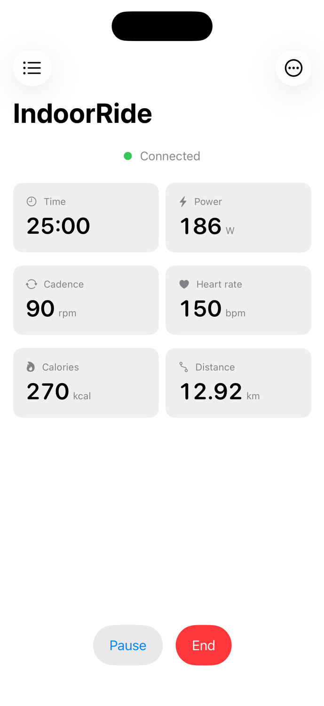
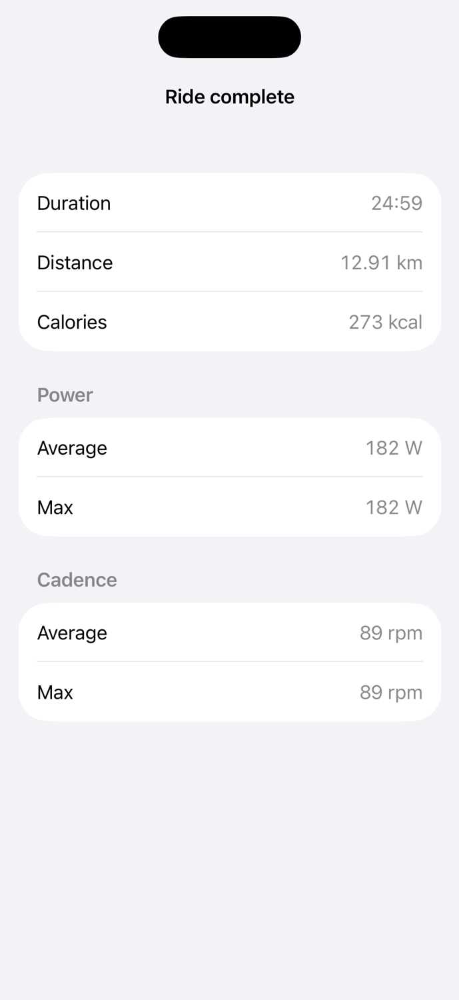
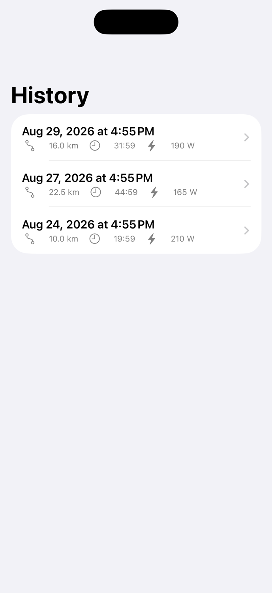

# IndoorRide

Record indoor cycling sessions from Bluetooth smart bikes and trainers to Apple
Health, with a paired iPhone and Apple Watch app. No subscription, no avatar, no
cloud: just an accurate ride.

This is **FTMS / CSC** code, not one-bike code. It works with any bike or trainer
that speaks the Bluetooth Fitness Machine or Cycling Speed and Cadence profiles:
the Schwinn IC4, the Bowflex C6 (the identical rebadged bike), the Schwinn IC8,
most smart trainers, power-meter pedals, and most Bluetooth spin bikes. The IC4
is the bike it was reverse-engineered and tested against, and the one the story
below is about.

[](https://github.com/mikelangmayr/indoorRide/actions/workflows/ci.yml)
[](LICENSE)


## Screenshots

<p>
  
  
  
</p>

## Why this exists

The Schwinn IC4 does not work with Apple's or Garmin's built-in sensor support,
and the reason is a pair of firmware quirks that break every always-paired
sensor stack:

- **Its Bluetooth radio only turns on while the pedals are moving.** It does not
  advertise while idle. Apple's Health Devices model, like Garmin's, looks for
  the sensor once when a workout starts and never scans again. At the moment you
  press Start you are not pedalling yet, so there is nothing on the air to
  connect to, and no data reaches the workout.
- **It advertises a Cycling Power service (0x1818) that it does not implement.**
  There is no such service in its GATT table. A watch pairs the bike as a power
  meter on the strength of the advertisement, then finds nothing to subscribe to.

IndoorRide turns the first quirk into a feature. It scans continuously, so the
bike appearing on the air *is* the signal that the rider started pedalling. It
ignores the phantom advertisement and reads the Fitness Machine service (FTMS,
0x1826) that the bike actually implements.

The same code works with any FTMS or CSC bike: the Bowflex C6 (the identical
rebadged bike), Schwinn IC8, most smart trainers, and most Bluetooth spin bikes.

### The parsing trap

The Indoor Bike Data characteristic (0x2AD2) packs its Total Distance field as a
**24-bit integer**, the only one in the whole profile. Read it as 16 or 32 bits
and every field after it silently shifts while still looking plausible. The
parser is validated against real packets captured from the hardware, cross-checked
by integrating speed against distance over a 60-second window.

## Features

- Continuous scan and auto-connect the instant the bike wakes up.
- Live power, cadence, speed, heart rate, and calories on iPhone and Apple Watch.
- Recording with time-weighted averages, energy computed from power (not the
  bike's inflated figure), auto-pause when you stop, and auto-stop when you leave.
- Start and stop from either device.
- Ride history and a post-ride summary, saved locally.
- Writes workouts to Apple Health (indoor cycling), never overwriting heart rate.
- A demo mode that replays a synthetic ride through the real pipeline, so the app
  runs with no bike present.

## Architecture

Domain logic is plain, testable Swift with no dependency on a view, a simulator,
or a live peripheral. The iPhone owns the Bluetooth connection; the Watch is a
second display and a remote.

| Component | Responsibility |
|---|---|
| `IndoorRideCore` | Platform-agnostic package: FTMS parser, session model, and the phone/watch message types. Shared by both apps. |
| `BikeConnection` | CoreBluetooth central: scan continuously, connect on discovery, resubscribe, survive dropouts. |
| `SessionRecorder` | Start/pause/stop, 1 Hz sampling, running totals, energy from power, auto-pause/stop, crash-safe persistence. |
| `RideConnectivity` | WatchConnectivity link: live metrics phone to watch, control commands watch to phone, final summary at ride end. |
| `WorkoutManager` (watchOS) | `HKWorkoutSession` for continuous heart rate and the HealthKit write. |

## Project layout

```
IndoorRide/                     iOS app (BLE, recording, UI)
IndoorRide Watch Watch App/     watchOS app (workout session, wrist UI)
IndoorRideCore/                 shared Swift package (parser, models, messaging)
IndoorRideTests/                unit tests
```

## Building

Requires Xcode and an iOS Simulator. Open `IndoorRide.xcodeproj` and run the
`IndoorRide` scheme, or from the command line:

```sh
xcodebuild test \
  -project IndoorRide.xcodeproj \
  -scheme IndoorRide \
  -destination 'platform=iOS Simulator,name=iPhone 17' \
  CODE_SIGNING_ALLOWED=NO
```

To connect to a real bike you need to run on a physical iPhone: start pedalling,
and the app connects and records automatically. With no bike, open the ellipsis
menu and choose **Demo mode** to replay a synthetic ride.

## License

Apache-2.0. See [LICENSE](LICENSE).

IndoorRide is not affiliated with Schwinn, Nautilus, Peloton, Zwift, Garmin, or
Apple. Product names are used only to describe compatibility.
